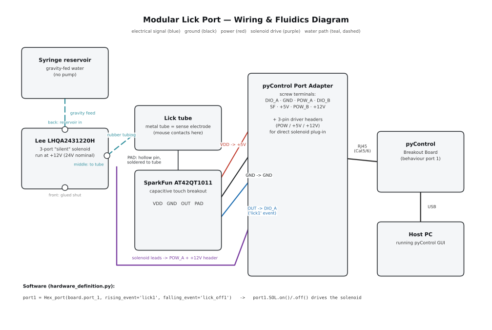

# Modular Lick Port — Build Guide

A capacitive-sensing, solenoid-driven water lick port for pyControl mouse behaviour rigs.

**Status:** internal lab reference, not for external distribution.

## 1. Overview

A modular nose-poke/lick panel for head-fixed or freely-moving mouse behavior rigs, built for a pyControl system. The panel presents a metal lick tube wired as a capacitive touch sensor (so licking/tongue contact is detected without a physical microswitch), and dispenses a gravity-fed water reward through a Lee Company solenoid valve. Everything connects to the rig's pyControl Breakout Board through a Port Adapter board.

## 2. Bill of materials

| Item | Part / model | Notes |
|---|---|---|
| 3D printed panel | `modular_poke-panel_slide V2.stl` | see §3 |
| Capacitive touch sensor | SparkFun AT42QT1011 breakout (SEN-12961) | single-channel touch IC |
| Port adapter | [pyControl Port Adapter](https://github.com/pyControl/hardware/tree/master/Port_adapter) | breaks an RJ45 behaviour port out to screw terminals |
| I/O hub | [pyControl Breakout Board](https://github.com/pyControl/hardware/tree/master/Breakout_board) | 6× behaviour ports, connects to host PC |
| Solenoid valve | Lee Company **LHQA2431220H** ("silent" solenoid, 3-port, 24V nominal) | run here at +12V from the port adapter — see §4.3 |
| Reservoir | Syringe, gravity-fed (no pump) | mounted above the panel, feeds the valve's back port |
| Tubing | Rubber tubing, solenoid middle port → lick tube | |
| Cabling | Cat5/6 (RJ45) patch cable, port adapter → breakout board | |
| Lick tube | Metal tube, doubles as the touch electrode | contacted via a hollow pin threaded around the tube and soldered on — see §4.1 |

## 3. Mechanical — 3D printed part

File: `modular_poke-panel_slide V2.stl` (binary STL, ~5.7 MB, 113,730 triangles).

## 4. Electronics

*(diagram file: `wiring_diagram.svg`, alongside this guide — keep it in the same folder for the image link above to resolve)*

### 4.1 Capacitive touch sensor — SparkFun AT42QT1011

| Pin | Function | Wiring |
|---|---|---|
| VDD/VCC | Power, 1.8–5V | → port adapter **+5V** terminal |
| GND | Ground | → port adapter **GND** terminal |
| OUT | Digital output — **HIGH while touched, LOW otherwise** | → port adapter **DIO_A** terminal |
| PAD | Sense electrode connection (extends the touch surface to an external electrode) | → lick tube |

The PAD wire is what makes the metal tube itself the touch surface: a hollow pin is threaded around the outside of the tube and the wire is soldered to it (both conductive), effectively wrapping the tube in the sense electrode. All four connections (VDD, GND, OUT, PAD) are accounted for.

### 4.2 pyControl Port Adapter

The adapter breaks one behaviour port's RJ45 pins out to screw terminals, matching the standard pyControl behaviour-port pinout:

| RJ45 pin | Signal |
|---|---|
| 1 | DIO_A |
| 2 | GND |
| 3 | POW_A |
| 4 | DIO_B |
| 5 | special function |
| 6 | +5V |
| 7 | POW_B |
| 8 | +12V |

It also has three headers carrying the driver (POW) lines plus +5V/+12V, meant for plugging a solenoid or lamp directly in — this is what you're using for the Lee solenoid.

Suggested wiring (channel "A"):

- Cap sensor **VCC → +5V** terminal
- Cap sensor **GND → GND** terminal
- Cap sensor **OUT → DIO_A** terminal
- Solenoid **→ POW_A / +12V** header (POW lines are low-side switches: pyControl grounds the POW line when the valve should open, so the solenoid's other lead sits at +12V continuously; each POW line can sink up to 200 mA)

Note on voltage: the LHQA2431220H is nominally a 24V valve, but the port adapter's driver headers only expose +5V/+12V, so it's being run under-voltage at +12V here. "Silent" Lee valves are commonly run this way (slower/quieter actuation, less force than at rated voltage) — you've confirmed this works fine in practice for this setup, just flagging it here so it's documented rather than assumed.

### 4.3 Solenoid & fluidics — LHQA2431220H (3-port)

- **Front port** (nearest the electrical pins): glued shut, unused
- **Middle port**: rubber tubing → lick tube (outlet, to the mouse)
- **Back port**: fed by the gravity-fed syringe reservoir (inlet)

### 4.4 RJ45 / Breakout Board

Port adapter → Cat5/6 patch cable → any one of the 6 numbered ports on the Breakout Board → USB/serial to the host PC running the pyControl GUI. Which port number you use just needs to match what you reference in the hardware definition file below.

## 5. Firmware — pyControl

Three pyControl code files live alongside this guide in the repo (kept as separate files rather than duplicated here, so there's one source of truth):

- **[`hex_port.py`](./hex_port.py)** — custom device class: a single cap-sensor + solenoid pair on one behaviour port (`DIO_A` for the touch sensor, `POW_A` for the solenoid). Note: this fixes a bug from the original version, `value()` referenced `self.input`, which was never set (the attribute is named `self.cap_sensor`) and would have raised `AttributeError` the first time it was called.
- **[`hardware_definition.py`](./hardware_definition.py)** — instantiates the board and `port1 = Hex_port(...)`, wiring `'lick1'`/`'lick_off1'` events to the touch sensor.
- **[`simple_reward_task.py`](./simple_reward_task.py)** — minimal task illustrating the core lick → reward loop (your actual production task additionally tracks per-port reward availability across a 6-port array with staggered timers, an ITI, and a session timer — this strips that away to just show the pattern: wait for a lick, open the solenoid for a fixed pulse, close it, go back to waiting).

`port1` exposes `port1.SOL` (a `Digital_output` on POW_A, switched with `.on()`/`.off()`) and `port1.value()` to poll current touch state.

## 6. Testing & troubleshooting checklist

- [ ] Touch tube with sensor powered → `port1.value()` / OUT should read HIGH; release → LOW
- [ ] Trigger `port1.SOL.on()` briefly from the pyControl GUI and confirm water reaches the tube with no leaks
- [ ] Calibrate reward pulse duration against actual dispensed volume (weigh output over ~20 pulses)
